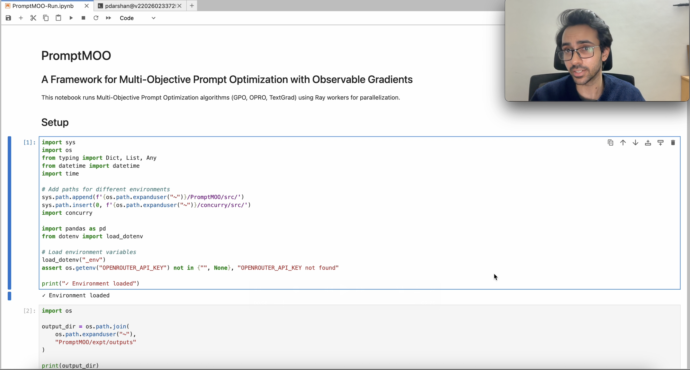

# PromptMOO

**PromptMOO: A Framework for Multi-Objective Prompt Optimization with Observable Gradients**

[](https://opensource.org/licenses/MIT)
[](https://openreview.net/group?id=aclweb.org/ACL/2026/Demo)
[](https://www.python.org/downloads/)


---

<p align="center">
  <a href="https://drive.google.com/file/d/1wbS2rYpeomiFlaY_8VEA7Z53WO99HD_d/view?usp=drive_link">
    
  </a>
</p>

<p align="center">
  <a href="https://drive.google.com/file/d/1wbS2rYpeomiFlaY_8VEA7Z53WO99HD_d/view?usp=drive_link">
    <picture>
      
    </picture>
  </a>
  <br/>
  <sub><b>Click the image above to watch the demo video (2.5 min)</b></sub>
</p>

---

## Overview

PromptMOO is an open-source Python framework for **multi-task prompt optimization** that unifies three prompt optimization algorithms — [TextGrad](https://arxiv.org/abs/2406.07496), [OPRO](https://arxiv.org/abs/2309.03409), and [GPO](https://arxiv.org/abs/2402.17564) — under a common modular pipeline.

**The problem:** Real-world LLM applications often require a single prompt to perform well across multiple evaluation criteria simultaneously (e.g., an LLM-as-a-Judge prompt must assess coherence, fluency, relevance, and consistency at once). Existing prompt optimization algorithms are single-objective and published as standalone, incompatible implementations.

**What PromptMOO does:**
- Unifies TextGrad, OPRO, and GPO under a **4-step optimization loop** (Predict → Compute Loss → Compute Gradient → Optimize Prompt)
- Extends these algorithms to **multi-task** settings via per-task loss/gradient decomposition with joint prompt update
- Provides **built-in observability** — every intermediate artifact (predictions, feedbacks, gradients, meta-prompts, optimizer responses) is logged to Parquet files for post-hoc analysis
- Enables **gradient conflict analysis** — measure inter-task optimization dynamics by computing cosine similarity of per-task textual gradients
- Supports **parallel experiment execution** via Ray workers with shared rate limiting

## Architecture

<p align="center">
  
</p>

Each step is an abstract base class with algorithm-specific subclasses registered via a typed `Registry`. Swapping algorithms requires changing a single string:

```python
LossComputer.of("opro")     # → OPROLossComputer (numeric only)
LossComputer.of("gpo")      # → GPOLossComputer (numeric + textual)
LossComputer.of("textgrad") # → TextGradLossComputer (textual only)
```

## Algorithm Comparison

| Component | OPRO | GPO | TextGrad |
|---|---|---|---|
| **Loss** | Numeric only | Numeric + Textual | Textual only |
| **Gradient** | Score summary (no LLM) | LLM-generated | LLM-generated |
| **Optimizer** | Top-k trajectory in meta-prompt | Trajectory + cosine edit budget | Current instructions + gradients |
| **History** | Top-k heap | Retrieval-based trajectory | Previous instructions only |

## Quick Start

### Prerequisites

- Python 3.10+
- An [OpenRouter](https://openrouter.ai/) API key (or any LiteLLM-compatible provider)
- [Ray](https://ray.io/) cluster (optional, for parallel execution)

### Installation

```bash
# Clone the repository
git clone https://github.com/ARDivekar/PromptMOO.git
cd PromptMOO

# Install dependencies
pip install -r requirements.txt

# Set your API key
export OPENROUTER_API_KEY="your-key-here"
```

### Running Experiments

The simplest way to run PromptMOO is through the experiment notebook:

```bash
jupyter notebook expt/PromptMOO-Run.ipynb
```

Or programmatically via the runner:

```python
from runner import AlgorithmRunner
from dataset import Dataset

# Configure experiments
experiments = []
for algo in ["opro", "gpo", "textgrad"]:
    experiments.append(dict(
        dataset=Dataset.of("SummEval", data_dir="./"),
        algorithm=algo,
        llm="llama3.1",
        steps=100,
        batch_size=24,
        api_key=os.getenv("OPENROUTER_API_KEY"),
    ))

# Launch parallel Ray workers
pool = AlgorithmRunner.options(
    mode="ray",
    max_workers=len(experiments),
).init()

# Submit all experiments
futures = {}
for exp in experiments:
    futures[exp['algorithm']] = pool.run(**exp)
```

### Analyzing Results

Every optimization run produces a `run_logs.parquet` file with columns:

| Column | Contents |
|---|---|
| `step` | Optimization step number |
| `batch` | Input samples for this step |
| `predictions` | Task LLM outputs |
| `feedbacks` | Loss LLM outputs (per-task numeric/textual feedback) |
| `gradients` | Gradient LLM outputs (per-task improvement suggestions) |
| `prompt_update` | Optimizer LLM output (old prompt → new prompt) |
| `algorithm_state` | Algorithm-specific state (trajectory, etc.) |
| `evaluation` | Validation set metrics and scores |

Load and analyze with:

```python
import pandas as pd
run_logs = pd.read_parquet("outputs/GPO_SummEval_run_XXXXX/run_logs.parquet")
```

## Project Structure

```
PromptMOO/
├── src/prompt_moo/
│   ├── algorithm.py            # Core 4-step loop + OPRO/GPO/TextGrad implementations
│   ├── task_predictor.py       # Step 1: Generate predictions via task LLM
│   ├── loss_computer.py        # Step 2: Compute per-task losses/feedback
│   ├── gradient_computer.py    # Step 3: Generate per-task textual gradients
│   ├── prompt_optimizer.py     # Step 4: Update prompt via optimizer LLM
│   ├── prompt_template_utils.py # Uni/Multi-objective prompt templates
│   ├── prompt_trajectory.py    # Top-k trajectory tracking for OPRO/GPO
│   ├── llm_workers.py          # Async LLM workers with rate limiting
│   ├── observability.py        # Parquet logging of all intermediate artifacts
│   ├── data_structures.py      # Typed data classes (Task, Batch, Feedback, etc.)
│   ├── data_input.py           # Dataset abstraction
│   ├── analysis.py             # Post-hoc metrics (Accuracy, F1, Precision, Recall)
│   └── context_manager.py      # Experiment run discovery and management
├── expt/
│   ├── PromptMOO-Run.ipynb     # Main experiment runner notebook
│   ├── runner.py               # AlgorithmRunner worker + experiment grid
│   └── setup_datasets.py       # Dataset preparation scripts
├── LICENSE                     # MIT License
└── README.md
```

## Key Design Principles

### Typed Registry Pattern
Every pipeline component inherits from `Typed` (immutable, validated data structures) and `Registry` (string-based subclass lookup). Adding a new algorithm requires implementing three subclasses (loss, gradient, optimizer) and registering them with a name string — the core pipeline remains unchanged.

### Fault Tolerance
LLM workers use [Concurry](https://github.com/concurry/concurry) for async execution with:
- Configurable rate limits (calls/min, tokens/min) via shared `LimitSet` pools
- Per-method retry policies (retry `call_llm` on parse failures and transient API errors)
- Multi-provider routing via [LiteLLM](https://github.com/BerriAI/litellm) (OpenRouter, DeepInfra, Groq, etc.)
- Experiment-level `resume_failed_runs` for checkpoint-based recovery

### Observability
An `ObservabilityManager` persists every intermediate artifact to Parquet, enabling:
- Post-hoc analysis without re-running experiments
- Gradient conflict analysis (cosine similarity of embedded textual gradients)
- Full reproducibility of optimization trajectories

## Supported Datasets

| Dataset | Domain | Tasks | Type |
|---|---|---|---|
| **SummEval** | Summary evaluation | coherence, consistency, fluency, relevance | Ordinal (1-5) |
| **WildGuard** | Safety evaluation | prompt harm, response harm, refusal | Categorical |
| **BRIGHTER** | Emotion intensity | anger, fear, joy, sadness, surprise | Ordinal (0-3) |

## Supported LLMs

PromptMOO supports any LLM accessible via [LiteLLM](https://github.com/BerriAI/litellm), with the following pairs set up for convenience:

| Configuration | Task LLM | Optimizer/Gradient/Loss LLM |
|---|---|---|
| `llama3.1` | Llama-3.1-8B-Instruct | Llama-3.1-70B-Instruct |
| `qwen3` | Qwen3-8B | Qwen3-VL-235B |
| `gpt4.1` | GPT-4.1-nano | GPT-4.1 |

## License

This project is licensed under the MIT License — see the [LICENSE](LICENSE) file for details.
