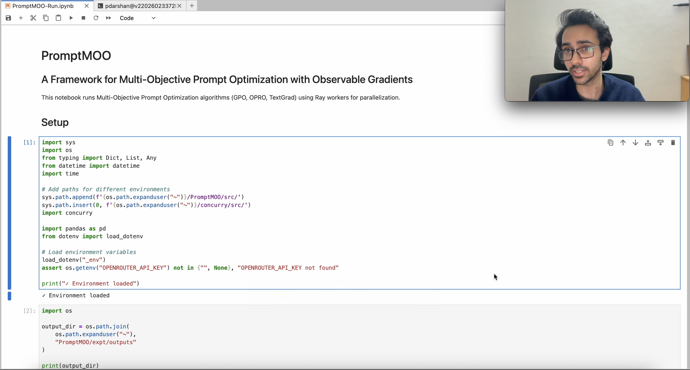
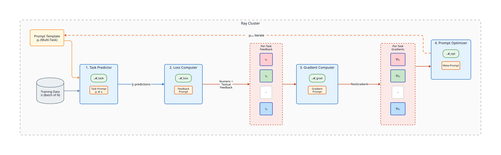

# PromptMOO

**PromptMOO: A Framework for Multi-Objective Prompt Optimization with Observable Gradients**

[](https://opensource.org/licenses/MIT)
[](https://www.python.org/downloads/)


---

<p align="center">
  <a href="https://drive.google.com/file/d/1wbS2rYpeomiFlaY_8VEA7Z53WO99HD_d/view?usp=drive_link">
    
  </a>
</p>

<p align="center">
  <a href="https://drive.google.com/file/d/1wbS2rYpeomiFlaY_8VEA7Z53WO99HD_d/view?usp=drive_link">
    <picture>
      
    </picture>
  </a>
  <br/>
  <sub><b>Click the image above to watch the demo video (2.5 min)</b></sub>
</p>

---

## Overview

PromptMOO is an open-source Python framework for **multi-task prompt optimization** that unifies three prompt optimization algorithms — [TextGrad](https://arxiv.org/abs/2406.07496), [OPRO](https://arxiv.org/abs/2309.03409), and [GPO](https://arxiv.org/abs/2402.17564) — under a common modular pipeline.

**The problem:** Real-world LLM applications often require a single prompt to perform well across multiple evaluation criteria simultaneously (e.g., an LLM-as-a-Judge prompt must assess coherence, fluency, relevance, and consistency at once). Existing prompt optimization algorithms are single-objective and published as standalone, incompatible implementations.

**What PromptMOO does:**
- Unifies TextGrad, OPRO, and GPO under a **4-step optimization loop** (Predict -> Compute Loss -> Compute Gradient -> Optimize Prompt)
- Extends these algorithms to **multi-task** settings via per-task loss/gradient decomposition with joint prompt update
- Provides **built-in observability** — every intermediate artifact (predictions, feedbacks, gradients, meta-prompts, optimizer responses) is logged to Parquet files for post-hoc analysis
- Enables **gradient conflict analysis** — measure inter-task optimization dynamics by computing cosine similarity of per-task textual gradients
- Supports **parallel experiment execution** via thread-based workers with shared rate limiting

## Architecture

<p align="center">
  
</p>

Each step is an abstract base class with algorithm-specific subclasses registered via a typed `Registry`. Swapping algorithms requires changing a single string:

```python
GradientComputer.of("opro")     # -> OPROGradientComputer (score summary, no LLM)
GradientComputer.of("gpo")      # -> GPOGradientComputer (LLM-generated)
GradientComputer.of("textgrad") # -> TextGradGradientComputer (LLM-generated)
```

## Algorithm Comparison

| Component | OPRO | GPO | TextGrad |
|---|---|---|---|
| **Loss** | Numeric only | Numeric + Textual | Textual only |
| **Gradient** | Score summary (no LLM) | LLM-generated | LLM-generated |
| **Optimizer** | Top-k trajectory in meta-prompt | Trajectory + cosine edit budget | Current instructions + gradients |
| **History** | Top-k heap | Retrieval-based trajectory | Previous instructions only |

## Quick Start

### 1. Prerequisites

- Python 3.12+
- An [OpenRouter](https://openrouter.ai/) API key

### 2. Installation

```bash
git clone https://github.com/ARDivekar/PromptMOO.git
cd PromptMOO

# Create and activate a conda environment (recommended)
conda create -n prompt_moo python=3.12 -y
conda activate prompt_moo

# Install dependencies
pip install uv
uv pip install -r requirements.txt
```

### 3. Set up your API key

```bash
# Copy the example env file
cp .env.example .env
```

Open `.env` in a text editor and fill in your OpenRouter API key:

```
OPENROUTER_API_KEY=sk-or-v1-your-key-here
```

> **To run the demo:** An OpenRouter API key with a small pre-loaded credit is available in the [supplementary materials Google Drive folder](https://drive.google.com/drive/folders/1NgTUm-8XZZS23h6F7cY2mimJUfTV3bbi). Look for the file named `PromptMOO-Demo-OpenRouter-key.txt`. If you cannot access it, please contact the repository owner.
>
> **Cost estimate:** A full experiment run (3 algorithms x 100 steps on SummEval) costs approximately **$5-10** on OpenRouter using the Llama 3.1 model configuration. A short test run (2 steps, batch_size=3) costs under $0.10.

### 4. Prepare the dataset

```bash
cd expt
python setup_datasets.py --datasets SummEval
```

### 5. Run the demo notebook

```bash
jupyter notebook expt/PromptMOO-Run.ipynb
```

Run cells sequentially. The notebook will:
1. Load your API key from `.env`
2. Configure experiments (algorithms, datasets, LLMs)
3. Launch parallel workers and submit optimization jobs
4. Monitor progress and collect results

### 6. Run tests (optional)

```bash
# Unit tests (no API key needed)
pytest --tb=short -rf tests/ -m unit

# Integration tests (requires API key)
pytest --tb=short -rf tests/ -m integration

# Full end-to-end tests (requires API key, runs 2-step training for each algorithm)
E2E_STEPS=2 E2E_BATCH_SIZE=3 pytest --tb=short -rf tests/test_e2e_unified.py -s -v --algorithms=opro,gpo,textgrad --timeout=600
```

## Programmatic Usage

```python
from runner import AlgorithmRunner
from dataset import Dataset

experiments = []
for algo in ["opro", "gpo", "textgrad"]:
    experiments.append(dict(
        dataset=Dataset.of("SummEval", data_dir="expt/"),
        algo_name=algo,
        llm="qwen3",
        api_key=os.getenv("OPENROUTER_API_KEY"),
    ))

pool = AlgorithmRunner.options(
    mode="threads",
    max_workers=len(experiments),
).init()

futures = {}
for exp in experiments:
    futures[exp['algo_name']] = pool.run(**exp)
```

## Analyzing Results

Every optimization run produces per-step Parquet files under `run_logs/` with the following data:

| Column | Contents |
|---|---|
| `step` | Optimization step number |
| `batch` | Input samples for this step |
| `predictions` | Task LLM outputs |
| `feedbacks` | Loss LLM outputs (per-task numeric/textual feedback) |
| `gradients` | Gradient LLM outputs (per-task improvement suggestions) |
| `prompt_update` | Optimizer LLM output (old prompt -> new prompt) |
| `algorithm_state` | Algorithm-specific state (trajectory, etc.) |
| `evaluation` | Validation set metrics and scores |

Load and analyze with:

```python
from prompt_moo.observability import ObservabilityManager
run_logs = ObservabilityManager.read_run_logs("outputs/GPO_SummEval_run_XXXXX/")
```

## Project Structure

```
PromptMOO/
├── src/prompt_moo/
│   ├── algorithm/              # Algorithm implementations
│   │   ├── gpo.py              #   GPO (Tang et al., AAAI 2025)
│   │   ├── opro.py             #   OPRO (Yang et al., ICLR 2024)
│   │   └── textgrad.py         #   TextGrad (Yuksekgonul et al., 2024)
│   ├── prompt_algorithm.py     # Core 4-step training loop
│   ├── config.py               # Centralized configuration (promptmoo_config singleton)
│   ├── task_predictor.py       # Step 1: Generate predictions via task LLM
│   ├── loss_computer.py        # Step 2: Compute per-task losses/feedback
│   ├── gradient_computer.py    # Step 3: Generate per-task textual gradients
│   ├── prompt_optimizer.py     # Step 4: Update prompt via optimizer LLM
│   ├── llm_utils.py            # Prompt suffix handling for reasoning-mode models
│   ├── prompt_template.py      # Multi-task prompt templates
│   ├── prompt_trajectory.py    # Top-k trajectory tracking for OPRO/GPO
│   ├── task_output_spec.py     # Output format specifications (ordinal, categorical, etc.)
│   ├── observability.py        # Per-step Parquet logging of all artifacts
│   ├── data_structures.py      # Typed data classes (Task, Batch, Feedback, etc.)
│   ├── data_input.py           # Dataset abstraction
│   ├── metrics.py              # Metric implementations (Accuracy, F1, Precision, Recall)
│   ├── analysis.py             # Post-hoc evaluation and visualization
│   └── context_manager.py      # Experiment run discovery and management
├── expt/
│   ├── PromptMOO-Run.ipynb     # Main experiment runner notebook
│   ├── runner.py               # AlgorithmRunner worker + LLM factory functions
│   ├── dataset.py              # SummEval, WildGuard, BRIGHTER dataset classes
│   └── setup_datasets.py       # Dataset preparation script
├── tests/                      # 669 unit + integration tests
├── .env.example                # Template for API key configuration
├── requirements.txt
├── LICENSE                     # MIT License
└── README.md
```

## Key Design Principles

### Typed Registry Pattern
Every pipeline component inherits from `Typed` (immutable, validated data structures) and `Registry` (string-based subclass lookup). Adding a new algorithm requires implementing three subclasses (loss, gradient, optimizer) and registering them with a name string. The core pipeline remains unchanged.

### Centralized Configuration
The `promptmoo_config` singleton holds all tunable defaults (timeouts, temperatures, max_tokens, rate limits, retry config). Use `temp_config()` for scoped overrides:

```python
from prompt_moo.config import temp_config

with temp_config(task_llm_max_tokens=512, max_rpm=200):
    results = algo.train(dataset, initial_prompt)
```

### Fault Tolerance
LLM workers use [SlowBurn](https://github.com/concurry/slowburn) for async execution with:
- Configurable rate limits (calls/min, tokens/min) via shared `LimitSet` pools
- Per-method retry policies (retry `call_llm` on parse failures and transient API errors)
- Multi-provider routing via [LiteLLM](https://github.com/BerriAI/litellm) (OpenRouter, DeepInfra, Groq, etc.)
- Experiment-level `resume_failed_runs` for checkpoint-based recovery

### Observability
An `ObservabilityManager` persists every intermediate artifact to per-step Parquet files, enabling:
- Post-hoc analysis without re-running experiments
- Gradient conflict analysis (cosine similarity of embedded textual gradients)
- Full reproducibility of optimization trajectories

## Supported LLMs

PromptMOO supports 100+ LLMs accessible via [LiteLLM](https://github.com/BerriAI/litellm).

For convenience, the following configurations are pre-defined in `runner.py`:

| Configuration | Task LLM (small) | Optimizer/Gradient/Loss LLM (large) |
|---|---|---|
| `llama3.1` | Llama-3.1-8B-Instruct | Llama-3.1-70B-Instruct |
| `qwen3` | Qwen3-8B | Qwen3-235B-A22B |
| `gpt5` | GPT-5-nano | GPT-5.2 |
| `claude4.5` | Claude Haiku 4.5 | Claude Sonnet 4.5 |

We suggest to run models through [OpenRouter](https://openrouter.ai/), which provides unified access and automatic provider failover. For demo, please use the provided key.

## License

This project is licensed under the MIT License. See [LICENSE](LICENSE) for details.
